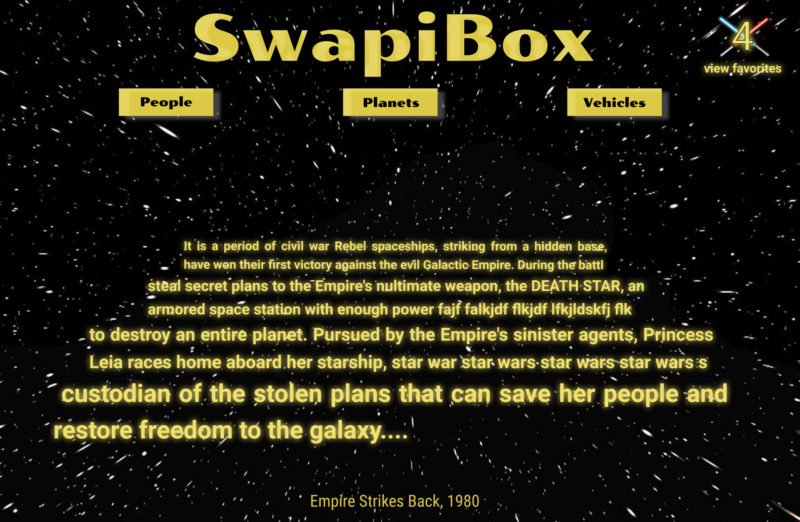
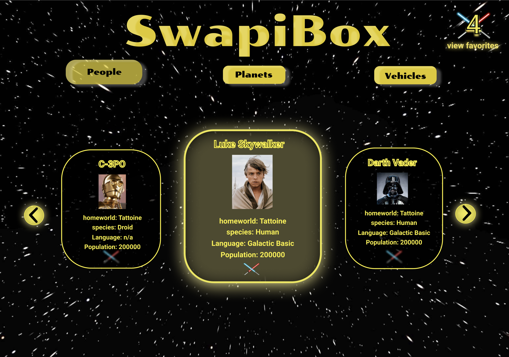
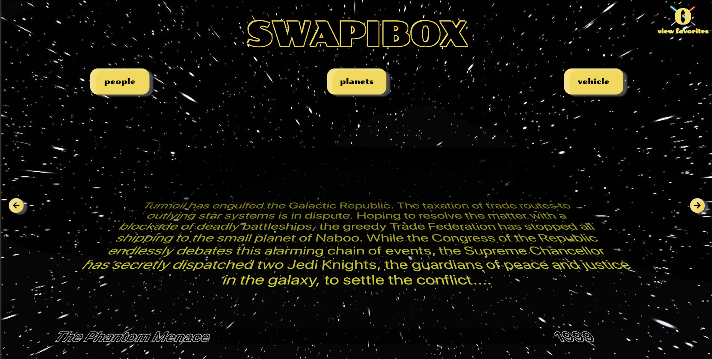
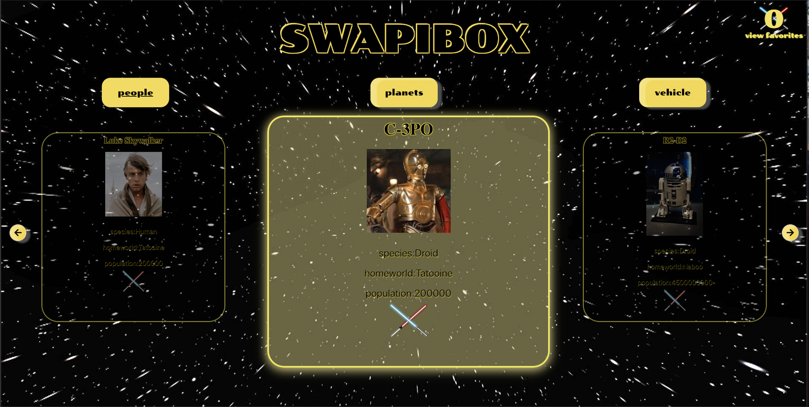

## SWAPI-Box

Swapibox is an exercise in fetching data from an api and rendering it using React. Key goals included writing dry code with minimal stateful components, cleaning incoming data, optimizing UX/UI, and implementing React Router, ES6, & ES7.

#### Project Partners:
* Cole Vanacore: https://github.com/colev1
* Ashton Bailey: https://github.com/ashtonkbailey

This project was bootstrapped with [Create React App](https://github.com/facebook/create-react-app).

#### Tech:
* React.js
* JSX
* Jest/Enzyme
* React Router
* Fetch/API Calls
* CSS

## Wireframes:

#### Loading Page

#### People Page

## Runtime Shots

#### Loading Page

#### People Page

